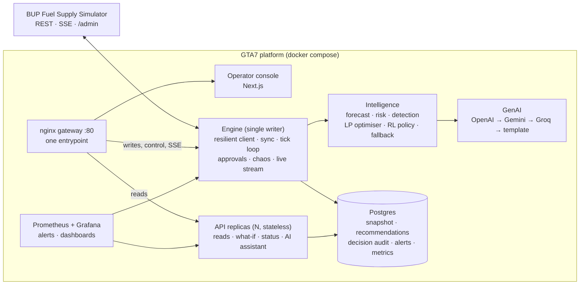

# GTA 7: Fuel Supply Intelligence & Resilience Platform

**BUP CSE FEST 26 · Hackathon Finals · Team GTA 7**
Ishmam Tahmid · Farhan Tahsin Khan · Mahmudul Hasan Sakib · Kazi Badrul Hasan

An operations platform for a simulated Bangladeshi fuel network (2 depots, 4 stations, 6 routes, 3 fuels). It
**observes** the BUP Fuel Supply Simulator, **detects** emerging shortages and disruptions, **predicts** demand and
stockout risk, **decides** constraint-aware allocations (LP optimiser, with an RL-tuned policy), lets an operator
**simulate** and **approve** them, and stays **observable and usable when components fail**.
All data is **simulated**; no real fuel infrastructure is accessed.

## Results at a glance
| Evidence | Result |
|---|---|
| With vs without the platform (combined crisis, same seed, 24 h) | **100% vs 83.4%** service level, **16,743 L** unmet demand avoided |
| No action vs LP vs RL (real simulator, 2 days) | **42.8% · 100% (76 trucks) · 100% (69 trucks, −9%)** |
| Crisis + fault test matrix (14 runs: single, mixed, faults + crises) | expected alerts in every run, **0 shipments rejected by the simulator** |
| Race conditions (20 simultaneous orders vs 12,000 L/tick cap) | exactly 12,000 L accepted, stock never negative, 0 duplicates |
| Load test (k6, 10 → 100 virtual users) | **0% errors**; p95 23 ms at 10 VUs; ~240 req/s per API process |
| Resilience (unavailable, error rate, latency, stale data, stream disconnect) | detected, contained, auto-recovered |
| Automated tests | **117 passing**, CI: build → test → deploy → health check → scale check |

Details: [`docs/TESTING_REPORT.md`](docs/TESTING_REPORT.md) · [`docs/LOAD_TEST.md`](docs/LOAD_TEST.md) ·
[`docs/RESILIENCE.md`](docs/RESILIENCE.md) · [`backend/app/intel/policy_comparison.png`](backend/app/intel/policy_comparison.png)

## Architecture

Simulator → data/backend → intelligence → decision → application → monitoring. Key principles:
- **Numbers from deterministic, constraint-checked code; language from the LLM.** The LLM never decides quantities.
- **Human in the loop:** manual mode by default; assisted mode auto-executes only high-confidence, small shipments.
  Every recommendation is inspectable (situation, impact before → after, signals, constraints, confidence, alternatives, what-if).
- **Single writer + scaled readers:** one engine makes and executes decisions (serialized, idempotent, re-validated
  against the latest state); stateless API replicas scale reads.
- **Every failure has a defined behaviour:** retries, circuit breaker, degraded mode on cached state, schema validation,
  stale-data detection, rule-based fallback policy, template fallback for GenAI.

More: [`docs/ARCHITECTURE.md`](docs/ARCHITECTURE.md) · [`docs/DEPLOY.md`](docs/DEPLOY.md) · [`docs/API_CONTRACT.md`](docs/API_CONTRACT.md)

## Run it
Requirements: Docker Desktop (or Docker Engine + Compose v2).
```bash
git clone https://github.com/ishmam259/gta7-fuel-supply.git && cd gta7-fuel-supply
cp .env.example .env        # set OPERATOR_KEY and (optional) OPENAI_API_KEY / GEMINI_API_KEY / GROQ_API_KEY
docker compose up -d --build
```
| Open | URL |
|---|---|
| Operator console | http://localhost |
| API docs (Swagger) | http://localhost/docs |
| System status | http://localhost/api/system/status |
| Grafana | http://localhost/grafana/ |
| Prometheus | http://localhost/prometheus/ |
| Simulator | http://localhost:8000/docs · console http://localhost:8000/admin |

Scale reads: `docker compose up -d --scale api=3 --no-recreate`. Without LLM keys everything still works; explanations use templates.
Operator actions (approve, mode, chaos) need the `X-Operator-Key` from `.env` (enter it via **Operator key** in the console).

### Configuration (`.env`, never committed)
| Variable | Purpose |
|---|---|
| `OPERATOR_KEY` | protects approvals, decision mode and chaos controls |
| `OPENAI_API_KEY`, `OPENAI_MODEL` | primary LLM (`gpt-4.1-nano,gpt-4o-mini`) |
| `GEMINI_API_KEY`, `GEMINI_MODEL` | second LLM provider |
| `GROQ_API_KEY`, `GROQ_MODEL_PRIMARY`, `GROQ_MODEL_FALLBACK` | third LLM provider |
| `POSTGRES_PASSWORD`, `GRAFANA_PASSWORD` | service credentials (defaults for local use) |

### Develop and test
```bash
cd backend && python -m venv .venv && .venv\Scripts\activate && pip install -r requirements.txt
python -m pytest -q tests                     # 117 tests
fastapi dev app/main.py --port 8090           # single-process dev mode (ROLE=all)
cd ../web && npm install && npm run dev       # console on :3000 (NEXT_PUBLIC_API_URL=http://localhost:8090)
bash loadtest/run.sh 50                       # k6 load test
```
Manual end-to-end checklist: [`docs/MANUAL_TEST_GUIDE.md`](docs/MANUAL_TEST_GUIDE.md). Crisis/fault scripts: `scripts/`.

## Repository map
| Path | What |
|---|---|
| `backend/app/` | FastAPI engine/API: resilient simulator client, sync engine, executor, routes, metrics |
| `backend/app/intel/` | forecast, risk, detection, LP optimiser, RL policy, GenAI, policy comparison |
| `web/` | operator console (Next.js + Tailwind + shadcn/ui) |
| `deploy/nginx.conf`, `docker-compose.yml` | gateway and full deployment |
| `ops/` | Prometheus config and alert rules, Grafana provisioning and dashboard |
| `scripts/` | reproducible crisis scenarios and fault drills |
| `loadtest/` | k6 workload and results |
| `docs/` | brief summary, architecture, API contract, deploy, testing, load test, resilience, evidence |

## Assumptions
- The simulator is the source of truth (REST); SSE is only a wake-up hint. One simulator instance per team.
- Quantities in litres, one tick = 15 simulated minutes; trucks depart on the tick they are ordered.
- Consequential decisions stay with a human operator unless assisted mode is explicitly enabled.

## Credits
**Provided by the organizers:** BUP Fuel Supply Simulator (`asifmahmoud414/bup-fuel-supply-simulator:1.0.0`) and its
integration guide; participant brief (BUP CSE FEST 26 / BUP Computer Programming Club, in association with Poridhi).

**AI models / APIs:** OpenAI API (`gpt-4.1-nano`, `gpt-4o-mini`) · Google Gemini API (`gemini-3.5-flash-lite`) ·
Groq API (`qwen/qwen3.8-27b`, `openai/gpt-oss-120b`, `openai/gpt-oss-20b`).

**Backend (Python):** FastAPI, Uvicorn, Pydantic, pydantic-settings, SQLModel / SQLAlchemy, psycopg, httpx,
prometheus-client, prometheus-fastapi-instrumentator, psutil, NumPy, SciPy (HiGHS LP solver), google-genai, groq,
openai, pytest, ruff.

**Frontend:** Next.js, React, TypeScript, Tailwind CSS, shadcn/ui, Base UI, class-variance-authority, cn,
lucide-react, next-themes, Recharts, Sonner, tw-animate-css, ESLint.

**Infrastructure & tooling:** Docker / Docker Compose, PostgreSQL, nginx, Prometheus, Grafana, k6, GitHub Actions.

**Development tools:** AI coding assistants (Claude Code; Poridhi Puku Editor/CLI available) were used for
implementation and testing, as permitted by the rulebook; architecture, contracts and decision logic are the team's own.
