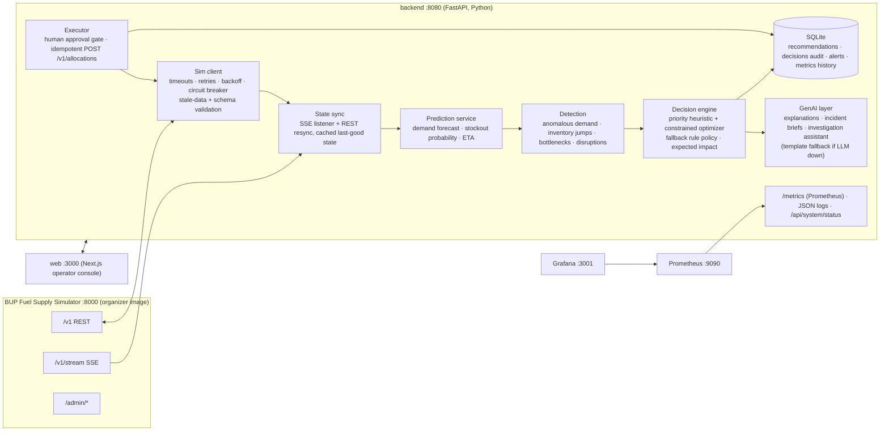

# Architecture — GTA 7 Fuel Supply Intelligence & Resilience Platform

## Components (all in `docker compose up`)

Required diagram chain (§19.6): **simulator → data/backend → intelligence → decision → application → monitoring**.

## Tick loop (Observe → Detect → Predict → Decide → Simulate → Act → Monitor → Recover)
1. **Observe**: on SSE `simulation.tick` (fallback: poll `/v1/instance` every 2 s) refresh snapshot via REST (REST = truth). Validate every response against Pydantic models; on invalid → reject + alert, keep last good state.
2. **Predict**: per (station, fuel): demand per tick for next H=16 ticks (4 h) = hour-of-day profile learned from `/v1/demand-history` × current `demand_multiplier`; residual std → uncertainty. Stockout time + **stockout probability** within horizon (normal approx). Supply ETA from `/v1/supply-arrivals` (DELAYED aware).
3. **Detect**: demand z-score anomaly vs forecast; inventory change inconsistent with demand+arrivals; depot dispatch saturation (bottleneck); active events / DISRUPTED routes / OUTAGE stations / CONSTRAINED depots → alerts with severity.
4. **Decide**: for each at-risk pair, candidate shipments over AVAILABLE routes (incl. cross-region backups gazipur→karnaphuli, patiya→mirpur). Respect ALL simulator rules: `qty ≤ route.max_shipment`, `≤ depot inventory`, depot `dispatch_capacity_per_tick` minus in-flight/pending this tick, station headroom. Priority = stockout probability × demand weight. Greedy priority allocation, optional LP (scipy HiGHS) to maximize risk reduction. Output **recommendations** with: reason, signals, constraints hit, confidence, alternatives, **expected impact (risk before → after)**. If prediction fails → **fallback rule policy** (reorder at 35 % capacity) and `fallback_activations` metric++.
5. **Simulate**: `POST /api/recommendations/simulate` projects inventory with/without the shipment (what-if) — no writes.
6. **Act**: human approval gate. Mode `manual` (default): operator approves/rejects. Mode `assisted`: auto-execute only when confidence ≥ 0.8 and qty ≤ 5000 L; everything else queued for review; low confidence → "human review requested". Executor POSTs with idempotency key `gta7-{rec_id}`; handles every 409/503 code (guide §9).
7. **Monitor**: Prometheus metrics (HTTP + domain + intelligence), structured logs, alerts table, system status panel.
8. **Recover**: circuit breaker opens after 5 consecutive sim failures → **degraded mode** (serve cached state, pause auto-execution, banner in UI), half-open probe via `/v1/health`, auto-close on success; SSE auto-reconnect + full REST resync.

## Principles to present
- LLM for language (explain, summarize, investigate); **deterministic, constraint-aware code for quantities**.
- Every failure mode has a defined behavior (§11 table in README).
- Measurable: same seed + same crisis script ⇒ A/B compare service level **with vs without** our platform (world is deterministic).

## Ports
simulator 8000 · backend 8080 · web 3000 · prometheus 9090 · grafana 3001
