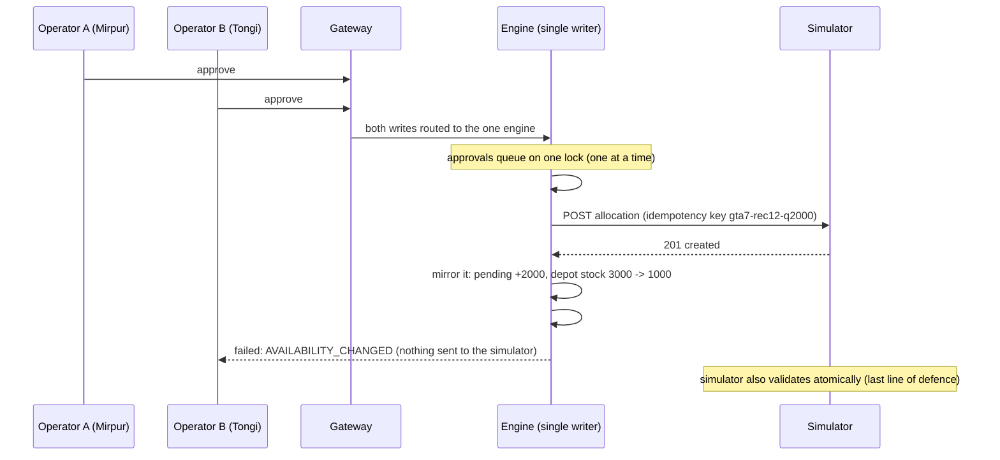

# Scenario, fault and race-condition test report

All tests ran on the full Docker deployment (engine + 2 API replicas + gateway + Postgres) against the organizer
simulator, using the crisis helpers in `scripts/scenarios/common.py` and fault helpers in `scripts/faults/test_fault.py`.
For every case the harness: resets the simulator → injects the events/faults → steps into the crisis → **checks the
platform** (expected alerts, every pending recommendation feasible, system status) → **approves every
recommendation like an operator** → counts simulator rejections → runs on and records service level.

## 0. Scripts as-is (smoke)
| Script | Result |
|---|---|
| `demand_spike.py`, `route_disruption.py`, `depot_constraint.py`, `shipment_delay.py`, `combined_crisis.py`, `test_simulator.py` | all exit 0, all HTTP calls 2xx |
| `test_fault.py latency / unavailable / error_rate / stale_data / stream_disconnect` | all inject (201) and clear (200) |

## 1. Each crisis alone
| Crisis | Detected by platform | Recommendations | Simulator rejections | Final service level |
|---|---|---|---|---|
| Demand spike (Mirpur ×2) | anomalous-demand + event alerts; cards cite "demand 2.0x normal" | all feasible | **0** | 100% |
| Route disruption (Gazipur→Mirpur) | disruption alerts | none on the closed route | **0** | 100% |
| Depot constraint (Gazipur) | bottleneck alert; cards "Gazipur Depot constrained" | all feasible | **0** | 100% |
| Shipment delay (Gazipur +8) | 11 disruption alerts; cards "upstream depot supply DELAYED" | all feasible | **0** | 100% |
| Supply shortfall (Patiya ×0.4) | shortage-risk alerts (no dedicated shortfall alert yet) | all feasible | **0** | 100% |
| Station outage (Tongi) | disruption alert; no shipments to the offline station | all feasible | **0** | 92.9% (demand at an offline station cannot be served) |

## 2. Crises mixed
| Mix | Active at check | Platform response | Rejections | Final SL |
|---|---|---|---|---|
| `combined_crisis.py` (spike + route + delay) | spike, route disruption | anomaly + 14 disruption alerts; cards: "demand 2.0x normal", "route gazipur-mirpur unavailable, using patiya-mirpur", "supply DELAYED" | **0** | 100% |
| Depot constraint + demand spike | both | bottleneck + anomaly alerts; cards: "Gazipur constrained", "demand 2.0x" | **0** | 100% |
| Both primary routes down (Mirpur + Karnaphuli) | 2 route disruptions | disruption alerts; cards reroute "patiya-karnaphuli unavailable, using gazipur-karnaphuli" | **0** | 100% |
| Everything: spike + route + depot + delay + shortfall + outage | 4 events | 17 disruption + bottleneck + anomaly alerts; every card feasible; all signals present | **0** | 94.3% (Tongi offline) |

## 3. Faults + crises mixed
| Fault + crisis | Status during fault | Platform response to the crisis | Rejections | After | Final SL |
|---|---|---|---|---|---|
| Combined crisis + **50% API errors** | healthy (retries absorbed the errors) | all crisis alerts + reroute/delay signals | **0** | healthy, recovery alert | 100% |
| Demand spike + **simulator down** | **DEGRADED, breaker OPEN**, cached state | after recovery: anomaly alert, valid cards | **0** | healthy, "recovered" | 100% |
| Route disruption + **stale data** (60 s) | DEGRADED/**STALE** flagged, stale-data alert | disruption alerts, cards valid | **0** | still stale when checked (fault still active; correct) | 100% |
| Depot constraint + **1 s latency** | healthy (below the 4 s timeout) | bottleneck alert, "Gazipur constrained" cards | **0** | healthy | 100% |

**Across all 14 platform runs: 0 simulator rejections, 0 infeasible recommendations in the inbox, every expected alert raised.**

## 4. Race conditions (Q3) and the dispatch limit (Q4)

### Is there a universal clock?
Yes: **the simulator tick** (one instance per team, 15 simulated minutes per tick). Every allocation
(`created_tick`, `departure_tick`, `expected_arrival_tick`), demand observation, event (`start_tick`/`end_tick`),
supply arrival and audit entry carries it, and our decision audit records it too. The platform never uses its own
wall clock for decisions.

### How concurrent orders are handled

Layers of protection: (1) the planner divides shared depot stock and dispatch capacity across all stations **in one
optimisation per tick**; (2) the gateway sends every write to the **single engine**; (3) approvals are **serialized**;
(4) each approval is **re-validated against the latest state**, including shipments approved seconds earlier in the same
tick; (5) **idempotency keys** make duplicate approvals harmless; (6) the **simulator** validates atomically.

### Results
| Test | Setup | Result |
|---|---|---|
| **R1:** raw race at the simulator | 20 simultaneous requests, same depot + tick: 60,000 L vs 12,000 L/tick cap | **Exactly 12,000 L accepted** (4/20), 16 `DISPATCH_CAPACITY_EXCEEDED`; diesel 60,000 → 48,000 exactly; **never negative** |
| **R2:** race through our platform | every pending card approved **twice, simultaneously** (8 requests, 4 cards) | **4 shipments, 0 duplicates**; Gazipur 10,900 ≤ 12,000 L; Patiya 10,350 ≤ 11,000 L |
| **R3:** audit | every allocation of the run, grouped per depot per tick | **0 dispatch-limit violations, 0 negative inventories** |
| Back-to-back approvals (unit) | two approvals from a depot with 5,000 L dispatch left, 3,000 L each | 1st executed, 2nd **blocked** "dispatch capacity left this tick …", only 1 request reached the simulator |
| Depot exhaustion (unit, Q3) | depot has 3,000 L; station A orders 2,000, station B orders 2,000 right after | A executed, B **blocked** "now has only 1000 L"; depot ends at **1,000 L (never negative)** |
| Same card approved twice at once (unit) | two concurrent approvals of one card | **one** shipment (serialized + idempotency key) |

**Found and fixed during this testing:** before the fix, approving all cards back to back during a multi-crisis made
the simulator reject 4 of them (`DISPATCH_CAPACITY_EXCEEDED`), because our pre-check used a snapshot that did not yet
include shipments approved seconds earlier in the same tick. The engine now mirrors each accepted shipment into its
state immediately, so later approvals are checked correctly (after the fix: 0 rejections). Also fixed: pending cards
whose route became disrupted now leave the inbox automatically ("superseded: route … is now DISRUPTED").
